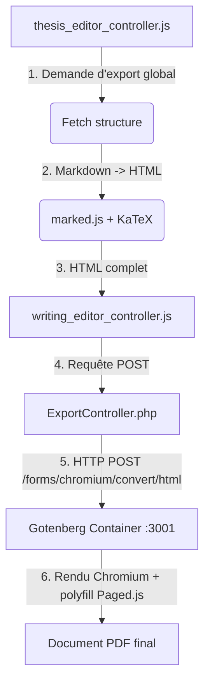

# État des lieux du projet — Éditeur de Thèse & Rendu PDF Gotenberg

Ce document résume les récentes évolutions techniques apportées à l'éditeur de thèse et au système de génération PDF (Gotenberg).

---

## 1. Architecture du Système de Rendu PDF

Le pipeline de rendu PDF utilise désormais **Gotenberg v8** en remplacement de WeasyPrint.

### Configuration Réseau & Docker (Local / Dev)
Pour permettre au conteneur Docker Gotenberg d'accéder aux images et ressources locales servies par le serveur Symfony CLI sécurisé (`https://127.0.0.1:8000`) :
* **Mise en correspondance DNS** : Gotenberg utilise `https://host.docker.internal:8000` pour communiquer avec la machine hôte.
* **Bypass de certificat SSL** : Gotenberg est configuré avec la variable `CHROMIUM_IGNORE_CERTIFICATE_ERRORS=true` (dans [compose.yaml](compose.yaml)) pour ignorer les avertissements liés au certificat auto-signé de Symfony CLI local.

---

## 2. Fonctionnalités implémentées

### Export Complet de Document (Thèse)
* **Bouton d'export global** : Un nouveau bouton **« Exporter le document »** a été ajouté en bas de la barre latérale gauche (contenant l'arborescence du plan) dans [thesis.html.twig](templates/project/thesis.html.twig).
* **Assemblage linéaire** : La méthode `exportFullPdf()` dans [thesis_editor_controller.js](assets/controllers/thesis_editor_controller.js) récupère toute la structure (qui contient déjà le texte de chaque chapitre) et assemble les sections hiérarchiquement :
  * `<h1>1. Chapitre principal</h1>`
  * `<h2>1.1 Sous-chapitre</h2>`
  * `<h3>1.1.1 Section</h3>`
* **Intégration transparente** : Le HTML assemblé est envoyé à l'instance enfant du contrôleur `writing-editor`, qui délègue la génération finale au service Gotenberg.

---

## 3. Correctifs de Bugs Majeurs

### Correctif du Rendu des Équations (KaTeX)
* **Problème** : Les formules mathématiques KaTeX (comme `\alpha`, `\sum`) insérées dans le document étaient purgées et disparaissaient du PDF final.
* **Origine** : Dans la fonction `transcribeLatex()`, la restauration des expressions mathématiques (Étape 8) se faisait *avant* la purge des macros LaTeX inconnues (Étape 9). La regex de purge effaçait tous les caractères `\` et les commandes de mathématique pensant qu'il s'agissait de macros orphelines.
* **Solution** : Inversion des étapes 8 et 9 dans [writing_editor_controller.js](assets/controllers/writing_editor_controller.js) et [print.html.twig](templates/export/print.html.twig). Les macros invalides sont purgées sur le texte *avant* la restauration des blocs mathématiques protégés. Les équations s'affichent maintenant correctement.

### Correctif du Sélecteur Stimulus (Multi-contrôleurs)
* **Problème** : Les sélecteurs du contrôleur de thèse échouaient à trouver l'instance de l'éditeur scientifique (`Éditeur introuvable`).
* **Origine** : Le wrapper de l'éditeur utilise deux contrôleurs : `data-controller="writing-editor editor-ai"`. Le sélecteur d'égalité stricte `[data-controller="writing-editor"]` ne trouvait aucun élément.
* **Solution** : Remplacement par un sélecteur de liste `[data-controller~="writing-editor"]` dans tout le fichier [thesis_editor_controller.js](assets/controllers/thesis_editor_controller.js).

### Robustesse de la Sauvegarde Automatique (Autosave)
* Ajout de blocs `try-catch` autour des appels de récupération de contenu (`getMarkdownContent()`) et d'écriture pour éviter qu'une indisponibilité momentanée ou un chargement partiel de l'éditeur au chargement de la page n'affiche un message d'échec rouge.

---

## 4. Recommandations pour la Production

Lors du déploiement en production :
1. Configurer la variable d'environnement `GOTENBERG_URL` dans le fichier `.env.local` pour cibler l'instance Gotenberg de production (ex: `http://gotenberg:3000`).
2. Configurer `APP_BASE_URL` pour cibler le nom de domaine réel de production (ex: `https://djolibasearch.com`).
3. Enlever l'option `--ignore-certificate-errors` de Gotenberg en production si vous utilisez des certificats SSL valides (ex: Let's Encrypt).
