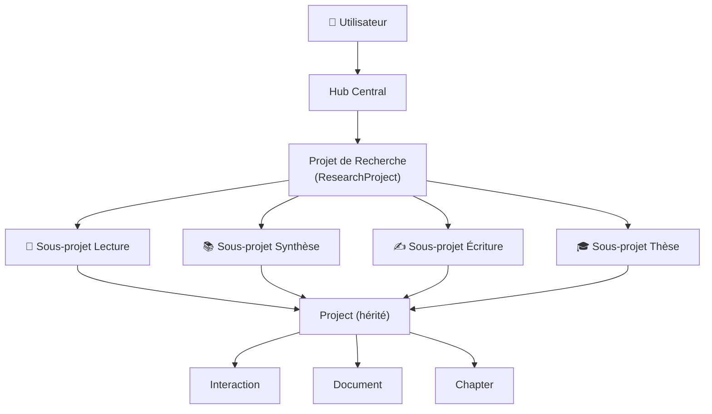

# 📋 Djoliba — Rapport de Statut du Projet

> **Date** : 27 juin 2026  
> **Version** : v2 (branche `main`, commit `99aca01`)  
> **Stack** : Symfony 7.4 · PHP 8.2 · PostgreSQL · TailwindCSS · Stimulus.js · DeepSeek AI  
> **Tests** : 54 tests, 275 assertions (100% OK)

---

## 1. Architecture Générale

### Modèle de données

| Entité | Rôle | Relations clés |
|---|---|---|
| **User** | Utilisateur authentifié | → ResearchProject, SubProject, Project |
| **ResearchProject** | Conteneur global de recherche | → SubProject (1:N), Project (1:N) |
| **SubProject** | Activité unitaire (lecture, synthèse, écriture, thèse) | → ResearchProject (N:1 nullable), Project (1:N cascade remove) |
| **Project** (hérité) | Projet legacy — assure la compatibilité | → SubProject (N:1 nullable), Interaction, Document, Chapter |
| **Interaction** | Échange IA (requêtes/réponses) | → Project, SubProject |
| **Document** | Fichier PDF téléversé | → Project, SubProject |
| **Chapter** | Chapitre de thèse | → Project, SubProject |
| **ProjectActivity** | Journal d'activité | → ResearchProject |
| **ProjectMember** | Membre collaboratif | → ResearchProject, User |
| **DailyMetrics** | Métriques quotidiennes | → User |

---

## 2. Fonctionnalités Implémentées

### 🔐 Authentification & Profil
- Inscription / Connexion avec hash bcrypt
- Vérification d'email (VerifyEmailBundle)
- Page de profil : ORCID, affiliation, champ de recherche
- Préférences : thème clair/sombre, langue (fr/en), aide contextuelle

### 🏠 Hub Central (`/hub`)
- Tableau de bord personnalisé avec salutation
- Barre de recherche synthétique globale (recherche web + synthèse IA)
- Actions rapides : « Analyser un PDF », « Revue de Littérature »
- Indicateur du projet de recherche actif (session)
- Liste des projets de recherche avec sélection/désélection
- Bouton « Nouveau projet de recherche » → modale de création

### 📁 Projets de Recherche (`ResearchProject`)
- CRUD complet (créer, lire, modifier, archiver, supprimer)
- API REST (`/api/research-projects/*`)
- Sélection d'un projet actif en session (`ProjectSwitcher`)
- Page de gestion dédiée (`/research-project/{id}`) avec :
  - En-tête (titre, description, statut)
  - Grille des sous-projets par type avec compteurs
  - Actions : créer, renommer, archiver, supprimer un sous-projet
  - Bouton export ZIP

### 📖 Lecture (`reading`)
- Glisser-déposer d'un PDF sur la page de liste → création automatique du sous-projet
- Upload de PDF avec extraction de texte (`smalot/pdfparser`)
- Synthèse IA automatique (points clés)
- Chat conversationnel avec le document (questions/réponses IA en streaming)
- Historique des interactions

### 📚 Synthèse / Revue de Littérature (`literature`)
- Recherche web via OpenSerp API
- Synthèse IA en streaming (SSE) avec contexte du projet de recherche actif
- Chaque clic sur « Analyser » crée un nouveau sous-projet `literature`
- Recherche de documents associés automatiquement
- Gestion des suggestions de lecture

### ✍️ Écriture (`writing`)
- Éditeur riche avec barre d'outils complète (92 Ko de contrôleur Stimulus)
- Sauvegarde automatique du contenu Markdown
- Assistance IA : reformulation, expansion, résumé, traduction
- Export en PDF, LaTeX, Markdown

### 🎓 Thèse / Mémoire (`thesis`)
- Structure en chapitres hiérarchiques (CRUD)
- Éditeur par chapitre avec assistance IA
- Plan détaillé généré par IA
- Export structuré (PDF, LaTeX)

### 🔍 Recherche Approfondie (`deep_search`)
- Interface dédiée pour recherche documentaire enrichie

### 📤 Export
- Export individuel (PDF, LaTeX, Markdown)
- Export ZIP de tout un projet de recherche (`ProjectExporterService`)

### 🧭 Navigation Unifiée
- Sidebar avec 4 sections d'activités (compteurs dynamiques)
- Sélecteur de projet de recherche actif
- Routes cohérentes : `/sub-projects/type/{type}`, `/sub-project/{id}`
- Redirection automatique vers l'activité après création d'un sous-projet

---

## 3. Forces du Projet

| Domaine | Détail |
|---|---|
| **Architecture** | Double couche `ResearchProject → SubProject → Project` assurant la compatibilité ascendante tout en permettant la restructuration progressive |
| **IA intégrée** | Streaming SSE natif via DeepSeek, contextualisation automatique des requêtes selon le projet actif |
| **UX chercheur** | Interface pensée pour le workflow de recherche académique (lecture → synthèse → rédaction → thèse) |
| **Tests** | 54 tests fonctionnels couvrant les parcours critiques (auth, CRUD projets, recherche, cascade de suppression) |
| **Design** | UI moderne (TailwindCSS, glassmorphism, micro-animations Stimulus), responsive, thème clair/sombre |
| **Sécurité** | Protection CSRF, ownership checks systématiques, session sécurisée, Symfony Security Bundle |
| **Export** | Multi-format (PDF via DomPDF, LaTeX via converter dédié, Markdown, ZIP) |
| **Modularité** | Services métier découplés (managers, services IA, services fichier) |

---

## 4. Limites & Dettes Techniques

### ⚠️ Critiques (blocantes pour la production)

| Problème | Impact | Fichier(s) |
|---|---|---|
| **Pas de rate-limiting** sur les endpoints IA | Un utilisateur peut saturer l'API DeepSeek et générer des coûts imprévus | `DeepSeekService.php`, `LiteratureController.php` |
| **Pas de HTTPS enforcing** dans la config | Le serveur Symfony local utilise HTTPS, mais rien ne force la redirection en production | `config/` |
| **Secret API DeepSeek en `.env`** | En production, le secret doit être géré via un gestionnaire de secrets (Vault, env serveur) | `.env` |
| **Pas de pagination** sur les listes de sous-projets | Performance dégradée si un utilisateur crée beaucoup de sous-projets | `SubProjectManager.php` |
| **1 test « risky »** | `testContextualizedPrompt` ferme des output buffers non gérés | `SearchControllerTest.php:49` |

### ⚡ Importantes (qualité / maintenance)

| Problème | Impact |
|---|---|
| **Coexistence de deux modèles** (`Project` + `SubProject`) | Complexité accrue, risque de désynchronisation des données |
| **Pas de migration progressive automatique** | Les anciens `Project` sans `sub_project_id` ne sont pas auto-migrés |
| **Pas de validation côté entité** (Symfony Validator) | Les validations sont manuelles dans les contrôleurs |
| **Pas de système de rôles avancé** | `ProjectMember` existe mais n'est pas exploité (owner/editor/viewer) |
| **Pas de logs d'audit** | `ProjectActivity` existe mais n'est pas alimentée automatiquement |
| **Éditeur d'écriture monolithique** | 92 Ko de JS dans un seul fichier Stimulus (`writing_editor_controller.js`) |
| **Pas de cache Redis activé en production** | `predis/predis` est installé mais non configuré en production |

### 💡 Mineures (améliorations ergonomiques)

| Problème | Impact |
|---|---|
| Pas de recherche / filtre dans la liste des sous-projets | Navigation fastidieuse avec beaucoup de projets |
| Pas de breadcrumb de navigation | L'utilisateur perd le contexte de hiérarchie |
| Pas de confirmation avant archivage d'un projet de recherche | Action irréversible trop accessible |
| Pas de notifications en temps réel (WebSocket) | L'utilisateur ne sait pas si un export long est terminé |

---

## 5. Cas d'Utilisation Principaux

### 🎯 Cas 1 — Étudiant en Master préparant un mémoire
1. Crée un projet de recherche « Mémoire M2 — IA et Sahel »
2. Utilise la barre de recherche pour des synthèses exploratoires → sous-projets `literature` auto-créés
3. Importe des articles PDF via drag & drop → sous-projets `reading` avec synthèse IA
4. Rédige ses chapitres dans l'éditeur `writing` avec assistance IA
5. Structure son mémoire avec l'outil `thesis` (plan + chapitres)
6. Exporte en PDF/LaTeX pour soumission

### 🎯 Cas 2 — Chercheur effectuant une veille bibliographique
1. Crée un projet « Veille — Agriculture durable 2026 »
2. Lance des recherches synthétiques hebdomadaires depuis le hub
3. Consulte et annote les résultats dans les sous-projets de synthèse
4. Exporte le tout en ZIP pour archivage

### 🎯 Cas 3 — Doctorant rédigeant sa thèse
1. Crée un projet « Thèse de doctorat — Énergies renouvelables »
2. Organise ses lectures par thématique (sous-projets `reading`)
3. Rédige ses revues de littérature (sous-projets `literature`)
4. Utilise l'éditeur de thèse pour structurer son manuscrit en chapitres
5. Exporte régulièrement en LaTeX pour compilation

---

## 6. Pistes d'Amélioration Avant Déploiement

### 🔴 Priorité Haute (pré-requis production)

| Action | Effort | Détail |
|---|---|---|
| **Configurer le rate-limiting** | 2h | Utiliser Symfony RateLimiter sur `/api/` et les endpoints IA |
| **Sécuriser les secrets** | 1h | Migrer les clés API vers les variables d'environnement serveur ou Vault |
| **Ajouter la pagination** | 3h | Paginer les listes de sous-projets et d'interactions (KnpPaginatorBundle ou Pagerfanta) |
| **Forcer HTTPS** | 30min | Configurer `access_control` et/ou un reverse proxy (Nginx/Caddy) |
| **Corriger le test risky** | 30min | Gérer les output buffers dans `SearchControllerTest` |
| **Ajouter des index BDD** | 1h | Indexer `sub_project.status`, `project.type`, `interaction.created_at` |

### 🟡 Priorité Moyenne (qualité & robustesse)

| Action | Effort | Détail |
|---|---|---|
| **Ajouter Symfony Validator** sur les entités | 3h | Contraintes `@Assert\NotBlank`, `@Assert\Length`, `@Assert\Choice` |
| **Migrer les anciens projets** | 4h | Script de migration progressive `Project` → `SubProject` |
| **Activer le cache Redis** | 2h | Configurer Symfony Cache avec Predis pour les sessions et le cache IA |
| **Découper `writing_editor_controller.js`** | 4h | Extraire en modules : toolbar, autosave, IA, export |
| **Ajouter des logs d'audit** | 3h | Alimenter `ProjectActivity` via un EventSubscriber Doctrine |
| **Implémenter les rôles collaboratifs** | 6h | Exploiter `ProjectMember` pour le partage de projets |

### 🟢 Priorité Basse (expérience utilisateur)

| Action | Effort | Détail |
|---|---|---|
| Breadcrumb de navigation | 2h | Composant Twig réutilisable |
| Recherche / filtre dans les listes | 3h | Champ de recherche Stimulus avec filtrage côté client |
| Notifications toast améliorées | 1h | Délai d'auto-dismiss, empilement |
| Mode hors-ligne (PWA) | 8h | Service Worker + cache local pour la lecture |
| Internationalisation complète | 4h | Fichiers de traduction `messages.fr.yaml` / `messages.en.yaml` |

---

## 7. Résumé Exécutif

| Métrique | Valeur |
|---|---|
| **Entités Doctrine** | 10 |
| **Contrôleurs** | 20 (dont 2 API) |
| **Services métier** | 14 |
| **Contrôleurs Stimulus** | 23 |
| **Templates Twig** | ~25 |
| **Tests PHPUnit** | 54 tests, 275 assertions |
| **Migrations** | 8 |
| **Dépendances PHP** | 34 packages |
| **Statut global** | ✅ Fonctionnel en développement, nécessite durcissement pour production |

> **Verdict** : Le projet Djoliba est fonctionnellement complet pour son périmètre initial (recherche → lecture → synthèse → rédaction → thèse). L'architecture est solide et extensible. Les **6 actions prioritaires** (rate-limiting, secrets, pagination, HTTPS, test risky, index BDD) représentent environ **8 heures de travail** et sont le minimum requis avant un déploiement en production.
